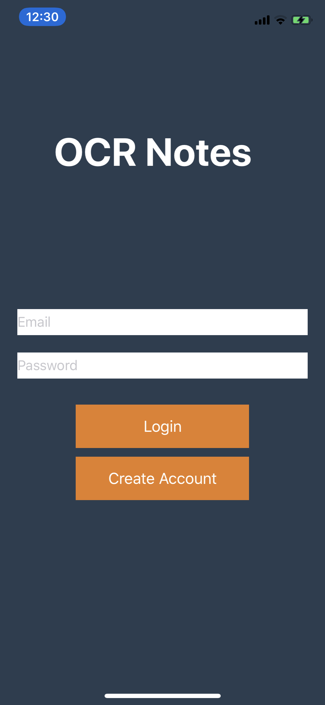
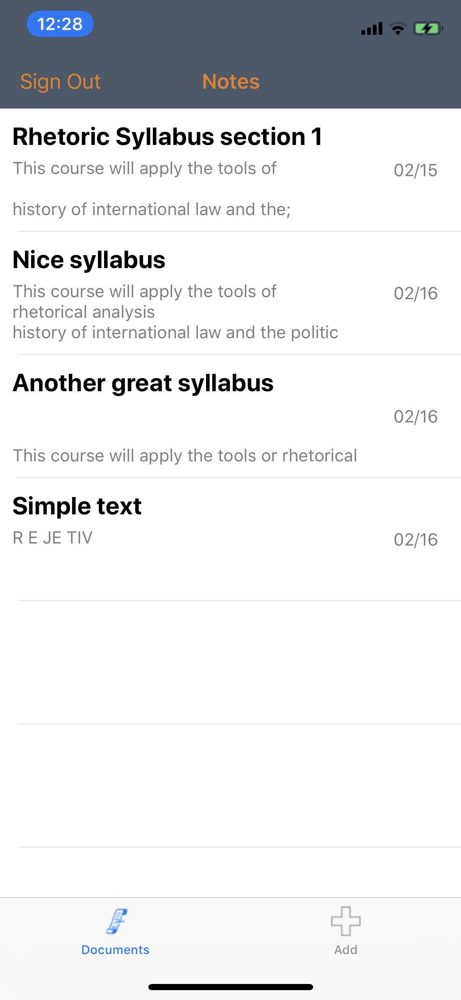
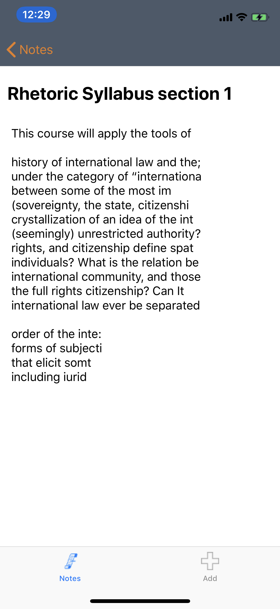
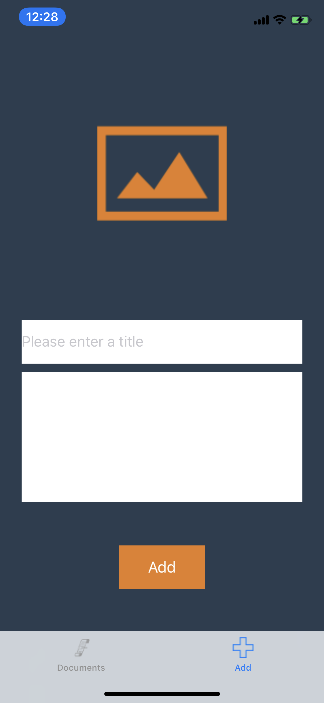
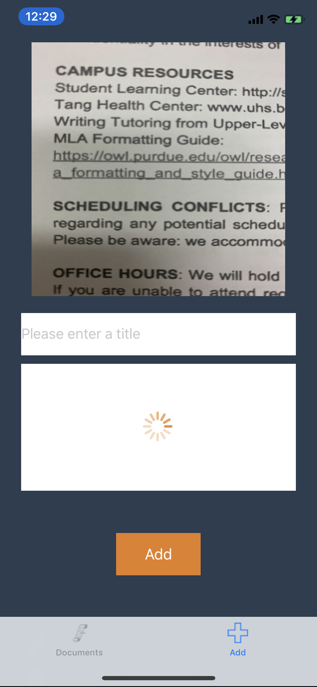

# MidwayReview
A worksheet made for the Mobile Developers at Berkeley iOS training program to prepare for the first Midway assessment.

# App Description
This app is document scanning app equipped with Firebase and Optical Character Recognition (OCR). Users can create an account and scan documents into the app. The text from these documents is uploaded into Firebase for storage. After a user scans a picture, they can see the extracted text in the document feed. Clicking on a document in the feed will present the user with a details page where they can edit the document's title as well as its body. These should be updated on Firebase.

I have implemented the OCR as well as other aspects of the program outside the scope of the training program. The rest is up to you. Be sure to look at ```DocumentManager```, ```Document```, and ```FirebaseUtils``` classes to understand the app model.

To complete the worksheet, simply fill in the functions marked with "TODO" and create the views based on the screenshots below. Some of the "TODO" markers will give you guidance on what to do while others leave it up to you for the implementation. To view the solutions, switch to the "Solution" branch with git.

# Spec
You must implement the following features/views. To do so, you can add any instance variables, methods, helper classes, and pods which you think are necessary.

- Firebase
  - You must set up the Firebase RealTimeDatabase yourself and import the appropriate pods
  - Login
  - Sign-up
  - Signout
  - Retrieving all documents for a specific user. A user should not be able to access another user's documents
  - Update a specific document with new values
- Document Feed
  - Is only shown if the user is logged in
  - Has a list of scanned documents
  - Has a signout UIBarButtonItem
  - Presents the DetailViewController when a document is clicked
- DetailViewController
  - Has an editable title field
  - Has an editable text view for the document body
  - The title field and text view should only be editable once the OCR is performed
  - The image view should be clickable to open the image picker
- LoginViewController
  - Allows the user to login/signup if they are not logged in already

See the following screenshots for more clarity.

# Screenshots

## Login


## Feed


## Detail


## Scanner


#Scanner Loading


# FAQs and Hints

## How is OCR happening
I have included a Pod called [Tesseract-iOS](https://github.com/gali8/Tesseract-OCR-iOS/wiki/Using-Tesseract-OCR-iOS]) which is an open source OCR engine made by Google.

## OCR is performing poorly
The Tesseract engine has many limitations, one of them being that it can be very inaccurate at times.

## Firebase isn't working
Make sure you have imported all your pods correctly, set up the real time database and authentication via the Firebase console, and have downloaded the GoogleService-Info.plst file.

## How do I use DatabaseManager
DatabaseManager is what is known as a Singleton. That means it can only be instantiated once. To access its methods and instance variables, you must do ```DatabaseManager.sharedInstance.*```

## App crashes on the simulator
The ```.camera``` source type doesn't work on UIImagePickerController in the simulator. To test the app in the simulator, comment out ```imagePicker.sourceType = .camera``` and replace it with ```imagePicker.sourceType = .photoLibrary``` in PicVC-ImagePicker.swift.

# I don't have a physical device to test this on
OCR still works even when selecting images from the image library. You can download images using the Simulator's Safari app. They will then be accessible in the Photo Library. Here are some documents you can try.

- https://business.tutsplus.com/tutorials/how-to-ocr-documents-for-free-in-google-drive--cms-20460
- https://thevisualcommunicationguy.com/2016/03/23/make-your-boring-documents-look-professional-in-5-easy-steps/
- 